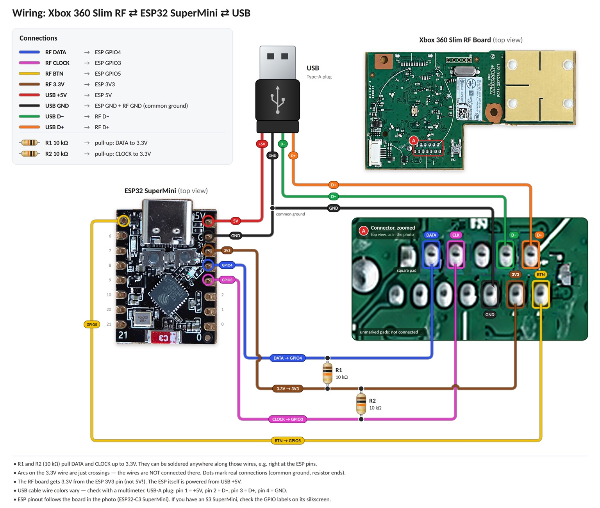
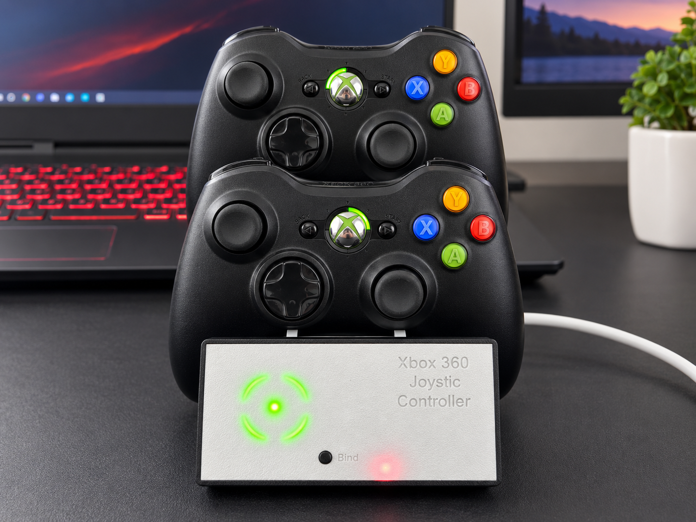
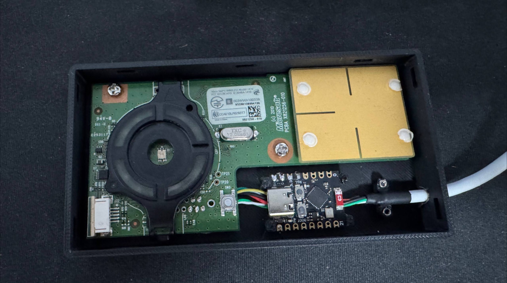
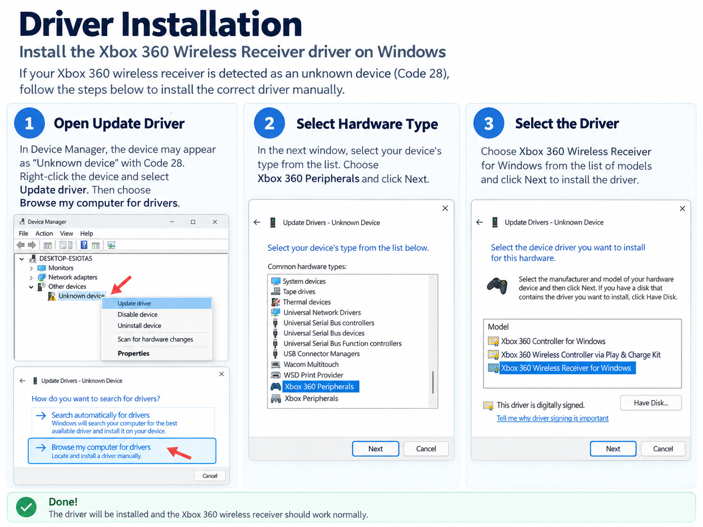

# Xbox 360 Slim RF Board + ESP32-S3 SuperMini USB Receiver

A DIY Xbox 360 wireless controller receiver built around the **original Xbox 360 Slim RF board** and an **ESP32-S3 SuperMini**.

The ESP32 initializes the Microsoft RF board and handles its DATA, CLOCK, and SYNC/BTN control lines. USB data is connected to the RF board, while the ESP32-S3 is powered from USB +5 V and supplies 3.3 V to the RF board.

> [!IMPORTANT]
> **Two external 10 kΩ pull-up resistors are mandatory.** DATA and CLOCK must each be pulled up to **3.3 V**. In this build the receiver does not work correctly without these resistors; the ESP32 internal pull-ups alone are not sufficient.



## Features

- Original Xbox 360 Slim RF board
- ESP32-S3 SuperMini controller
- Support for original Xbox 360 wireless controllers
- Original RF board pairing / Sync button support
- USB connection to Windows
- Standard Microsoft **Xbox 360 Wireless Receiver for Windows** driver
- Custom 3D-printable enclosure



## Hardware

- Xbox 360 Slim RF board
- ESP32-S3 SuperMini
- USB cable
- **2 × 10 kΩ resistors**
- Hook-up wire
- Soldering equipment
- Optional 3D-printed enclosure

The enclosure model is included in [`hardware/xbox360-slim-rf-receiver-enclosure.3mf`](hardware/xbox360-slim-rf-receiver-enclosure.3mf).

### Internal assembly



## Wiring

### RF board ↔ ESP32-S3 SuperMini

| RF board signal | ESP32-S3 SuperMini |
|---|---|
| DATA | GPIO4 |
| CLOCK | GPIO3 |
| BTN / SYNC | GPIO5 |
| 3.3 V | 3V3 |
| GND | GND |

### USB

| USB signal | Connection |
|---|---|
| +5 V / VBUS | ESP32-S3 5V |
| GND | ESP32-S3 GND + RF board GND (common ground) |
| D− | RF board USB D− |
| D+ | RF board USB D+ |

The RF board is powered from the ESP32-S3 **3V3** pin, **not directly from USB 5 V**.

USB cable colors are not guaranteed. Verify the conductors with a multimeter before soldering. A typical USB-A cable uses pin 1 = +5 V, pin 2 = D−, pin 3 = D+, pin 4 = GND.

## Mandatory pull-up resistors

Install two external **10 kΩ** pull-up resistors:

```text
3.3 V
  │
  ├── 10 kΩ ── DATA  ── GPIO4
  │
  └── 10 kΩ ── CLOCK ── GPIO3
```

- **R1: 10 kΩ** from DATA to 3.3 V
- **R2: 10 kΩ** from CLOCK to 3.3 V

They can be soldered anywhere along the DATA and CLOCK lines; placing them near the ESP32 pins is convenient.

> [!WARNING]
> Do not omit R1 and R2. Without the external pull-ups, communication with the RF board does not work correctly in this build.

## ESP32 pin assignment

The firmware uses:

```cpp
static constexpr uint8_t RF_CLOCK_PIN = 3;
static constexpr uint8_t RF_DATA_PIN  = 4;
static constexpr uint8_t SYNC_PIN     = 5;
```

So:

```text
GPIO3 -> RF CLOCK
GPIO4 -> RF DATA
GPIO5 -> RF BTN / SYNC
```

## Firmware

The firmware is in [`firmware/xbox360_rf_receiver.ino`](firmware/xbox360_rf_receiver.ino).

The RF board is initialized with the following command sequences:

```cpp
static const uint8_t START_COMMAND[10] = {
  0, 0, 0, 0, 0, 1, 0, 0, 1, 0
};

static const uint8_t POWER_COMMAND[10] = {
  0, 0, 1, 0, 0, 0, 0, 1, 0, 1
};

static const uint8_t SYNC_COMMAND[11] = {
  0, 0, 0, 0, 0, 0, 0, 1, 0, 0, 1
};
```

### RF board communication

The Xbox 360 Slim RF board generates CLOCK. To send a command, the ESP32 pulls DATA low to start the transaction and then updates DATA in sync with the RF board clock.

For each bit:

1. Wait for CLOCK LOW.
2. Set DATA to the required bit value.
3. Wait for CLOCK HIGH.
4. Repeat for the next bit.

After the final bit, DATA is driven HIGH and then released.

## Pairing a controller

After power-up the firmware initializes the RF board automatically.

To start pairing:

1. Turn on the Xbox 360 wireless controller.
2. Start Sync mode on the receiver by pressing the RF board Sync button, or send `S` in the serial monitor.
3. Press the Sync button on the controller.
4. Wait for the controller to pair.

The corresponding green quadrant on the RF board should remain illuminated after pairing.

## Serial commands

Serial baud rate: **115200**.

| Command | Function |
|---|---|
| `S` / `s` | Start controller synchronization |
| `I` / `i` | Reinitialize the RF board |

## Windows driver installation

Windows may initially detect the receiver as **Unknown device (Code 28)**. Install the standard Microsoft Xbox 360 receiver driver manually.



1. Open **Device Manager**.
2. Right-click the unknown device and choose **Update driver**.
3. Select **Browse my computer for drivers**.
4. Select **Let me pick from a list of available drivers on my computer**.
5. Choose **Xbox 360 Peripherals**.
6. Select **Xbox 360 Wireless Receiver for Windows**.
7. Confirm the installation.

After installation, Windows should treat the device as an Xbox 360 wireless receiver.

## Troubleshooting

### RF board does not respond / CLOCK timeout

Check these first:

- R1: DATA → 10 kΩ → 3.3 V
- R2: CLOCK → 10 kΩ → 3.3 V
- GPIO4 → DATA
- GPIO3 → CLOCK
- GPIO5 → BTN / SYNC
- RF board powered from 3.3 V
- Common ground between USB, ESP32-S3, and RF board

The external pull-ups are mandatory for this build.

### Windows shows Unknown Device

Manually select:

```text
Xbox 360 Peripherals
└── Xbox 360 Wireless Receiver for Windows
```

## Project files

```text
.
├── README.md
├── firmware/
│   └── xbox360_rf_receiver.ino
├── hardware/
│   └── xbox360-slim-rf-receiver-enclosure.3mf
└── images/
    ├── wiring-diagram.jpg
    ├── internal-assembly.jpg
    ├── receiver-with-controllers.png
    └── driver-installation.png
```

## Disclaimer

This is an unofficial hardware modification project. Xbox, Xbox 360, and Microsoft are trademarks of Microsoft Corporation. This project is not affiliated with or endorsed by Microsoft.
